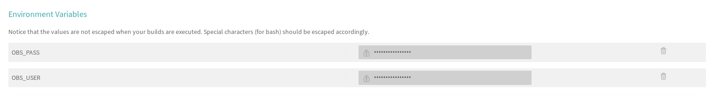

# Continuous delivery project

This project is used to store a docker container to upload new package updates
to [Open Build Service](https://openbuildservice.org/).

It uses a predefined oscrc file which has to be hacked by environment variables
to update the user and password to give upload right to osc (OBS command line
tool).

## How to use

This example will be based in [travis ci](https://travis-ci.org/) but it could
be extrapolated quite easily to any other CI tool (jenkins, gitlab, etc) or even
locally.

These steps must be followed to run the delivery operation:

1. Pull the docker image. The image is currently stored in: https://cloud.docker.com/u/xarbulu/repository/docker/xarbulu/continuous_delivery

```bash
docker pull xarbulu/continuous_delivery:latest
```

2. Set the environment variables. This is not mandatory but it will facilitate
things:

```bash
export OBS_USER=my-user # my obs user name
export OBS_PASS=my-pass # my obs user password
export OBS_PROJECT=my-project # obs project
export PACKAGE_NAME=my-package # package name in obs project
export FOLDER=/package # used folder inside the docker container where our code is located
```

Here other optional parameters:

```bash
export TARGET_PROJECT=target-project # target project to create a submit request
```

3. Run the docker container

```bash
docker run -t -v "$(pwd):/package" -e OBS_USER=$OBS_USER -e OBS_PASS=$OBS_PASS -e OBS_PROJECT=$OBS_PROJECT -e PACKAGE_NAME=$PACKAGE_NAME xarbulu/continuous_delivery /bin/bash -c "cd /package;/upload.sh"
```

*FOLDER* variable must match with the path used in the volume creation and last
command execution


## Example

In [.travis.yml](.travis.yml.example) you can find an example travis file that
might be used to in your project.

For that, you must set your OBS user and password in the travis project settings.



## How to contribute

To contribute the project just update the project code and create a pull request.
After merging the code the new docker image will be created automatically.
